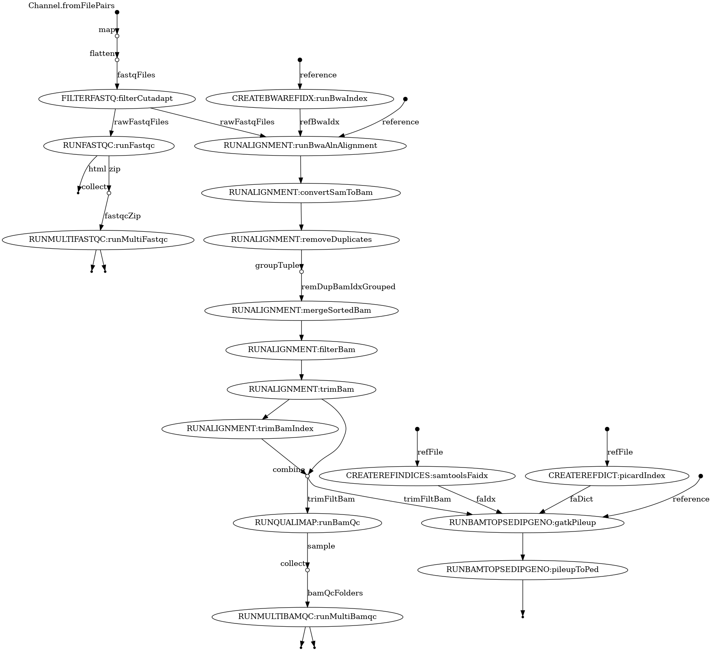

## AncientSingleEndSeqAlignmentPipeline: AncSEqAlign

[](https://nodesource.com/products/nsolid)

[](https://travis-ci.org/joemccann/dillinger)

AncSeqAlign is a nextflow-based pipeline which combines multiple open-source tools to align the single end Illumina sequences (Phred scale encoded using ASCII 33 to 93) that are generated from the ancient DNA sample. The pipeline, by taking into accounts the specific characteristics of ancient DNA such as short read fragements, damaged nucleotides due to deamination of unmethylated cytosines, sets the parameters of various tools as recommended in these studies (https://doi.org/10.1093/bib/bbab076, https://www.science.org/doi/10.1126/science.aav1002). 

## The pipeline in brief (beta-version):
The pipeline starts with the raw fastq files of the ancient samples and generate pseduo-diploid genotypes in plink format after carrying out the standard alignment procedures with the settings optimized for the ancient DNA samples. All the main parameters such as input files, reference files, and the steps to be performed should be provided in ./AncSEqAlign.config. Note that the input reference should be indexed with bwa. 

**Step 1**). FILTERFASTQ

parameter file: ./parameters/filterFastq.config\
module file: ./modules/runCutAdapt.nf

**Sub-step 1.1** filterCutAdapt\
tool used: cutadapt (v 4.0)\
purpose: to trim the adapter sequences and filter fastq-reads\
parameters: illumina adapters (set to "AGATCGGAAGAGCACACGTCTGAACTCCAGTCAC"),  minimum adapter overlap (set to 1 ) bp and minimum read length (set to 30 bp)\
conda installation file : ./conda/cutadapt.yaml

**Step 2**). RUNFASTQC

parameter file: ./parameters/runFastqc.config\
module file: ./modules/runFastqc.nf

**Sub-step 2.1** runFastqc\
tool used : fastqc (v 0.11.9)\
purpose: quality-assessment of the trimmed fastq files (generated in the step 1)\
parameters: min_length (set to 0), contaminant file, adapter file and limit file not included (-c, -a and -l flags, respectively), the value of kmers (set to 7, default value), location of temporary folder for the fastqc (fastqcTmpDir) and the location of the output files of the fastqc (fastqcResultsOut)\
conda installation file: ./conda/fastqc.yaml


**Step 3**). RUNALIGNMENT

Parameter file: ./parameters/runAlignment.config\
module file: ./parameters/runAlignment.nf

**Sub-step 3.1** runBwaAlnAlignment\
tool used: Bwa-aln (v 0.7.17)\
purpose: the previous studies (https://doi.org/10.1093/bib/bbab076, https://doi.org/10.1002/ece3.8297) have shown that bwa-aln is still the best aligner to align the short fragements of ancient DNA sequences\
parameters: whether or not to create the bwa index of the reference file (createBwaIndex= "Yes" or "No"), seedLengthValue (-l 1024).\
conda installation file: ./conda/bwa.yaml\
Other remarks: after running bwa aln, bwa samse will be run to convert the output file of the aln to sam file. During this step, read group info, "RG, SM and PL:Illumina", tags wil be added.\

**Sub-step 3.2** convertSamToBam\
tool used: samtools (v 1.14)\
purpose: convert sam file to bam file (including its index)\
conda installation file: ./conda/samtools.yaml\
**If the sample has more than one fastq files, all the processes until the sub-step 3.2 (cutadapt, fastqc and bwa) will be run on each of the fastq file individually (in parallel).**

**Sub-step 3.3** mergeSortedBam\
tool used: samtools (v 1.14)\
purpose: merge the individual bam files of the same sample.\
conda installation file: ./conda/samtools.yaml

**Sub-step 3.4** removeDuplicates\
tool used: picard (v 2.27.2)\
purpose: to remove the duplicate reads from the aligned bam file.\ 
conda installation file: ./conda/picard.yaml\

**Sub-step 3.5** filterBam\
tool used: samtools (v 1.14)\
purpose: filter the bam file based on the mapping quality\
parameters: minimum mapping quality (default = 25), filterBamOut (path to the folder where the filtered bam files will be copied).\
conda installation file: ./conda/samtools.yaml

**Sub-step 3.6** trimBam\
tool used: bamutil (v 1.0.15)\
purpose: hard-clipped the first "n" base pairs from each side of the aligned reads (to control for the degradation of nucleotides in the ancient sample)\
parameters: number of trimmed bases (default = 3 bp), filterBamOut (path to the folder where the filtered bam files will be copied)\
conda installation file: ./conda/bamutil.yaml

**Step 4**). RUNBAMTOPSEDIPGENO

Parameter file:./parameters/runBamToPseDipGeno.config\
module file: ./modules/runBamToPseDipGeno.nf

**Sub-step 4.1** samtoolsBamIndex\
tool used: samtools(v 1.14)\
purpose: index the trimmed bam file generated after the Sub-step 3.6\
conda installation file: ./conda/samtools.yaml

**Sub-step 4.2** samtoolsFaidx\
tool used: samtools(v 1.14)\
purpose: generate fasta index of the reference file\
conda installation file: ./conda/samtools.yaml

**Sub-step 4.3** picardIndex\
tool used: picard(v 2.27.2)\
purpose: generate dict file required to run gatk pileup command\
conda installation file: ./conda/picard.yaml

**Sub-step 4.4** gatkPileup\
tool used: gatk4(v 4.2.6.0)\
purpose: generate pileup of the bam file\
conda installation file: ./conda/gatk4.yaml

**Sub-step 4.5** pileup2plink\
tool used: pileup2plink(v 0.0.1)\
purpose: generate plink file from the pileup file generated in the previous step\
tool location: ./bin/pileup2plink\
parameters: minimum base quality for the base to consider (default value is 25), pedResultsOut (the folder in which the final output files, ped and map, will be stored). 



## Options for running the pipeline on Linux HPC
In the nextflow.config file, the profile "cluster" has been added to take into account the SLURM executor.The user can change and optimized the resources mentioned under different labels (such as "oneCpu", "sixteenCpus"). If you change these labels, also remember to apply these changes in the respective module file.  If the HPC has been more than one cluster, then user should export the appropriate cluster variables, in case of SLURM, it could be, "export SLURM_CLUSTERS=inter", before running the pipeline. 

## Installation and dependencies
To run this pipeline, users need to have conda and nextflow installed. After clonning this repository, the user need to run the following command

```sh
nextflow run -qs 2 AncSEqAlign.nf -profile cluster -bg
```
By default, the program will use conda to install the dependencies and run the pipeline. 

## To do
also implement MapDamage for base quality score recalibration
pileup2fasta
implement the entire pipeline (including the customized tool) in a singularity container 

## License

MIT

**Free Software, Hell Yeah!**
